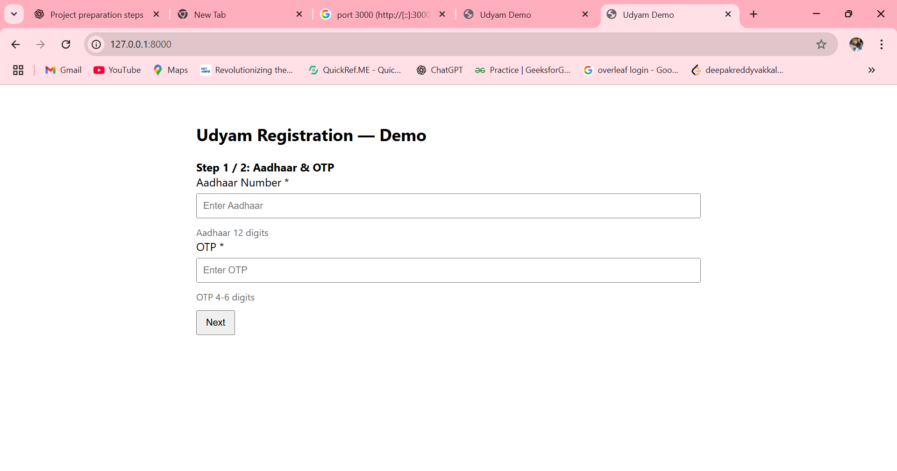
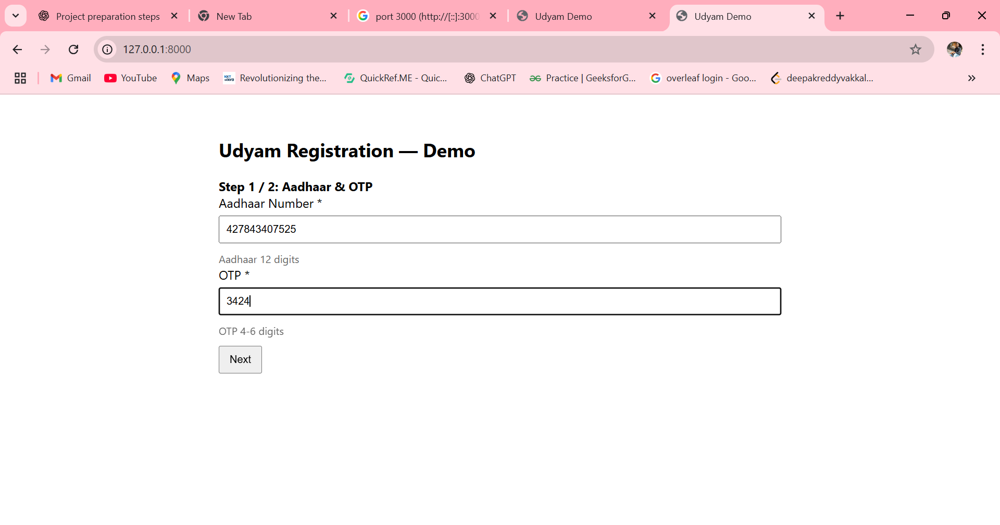
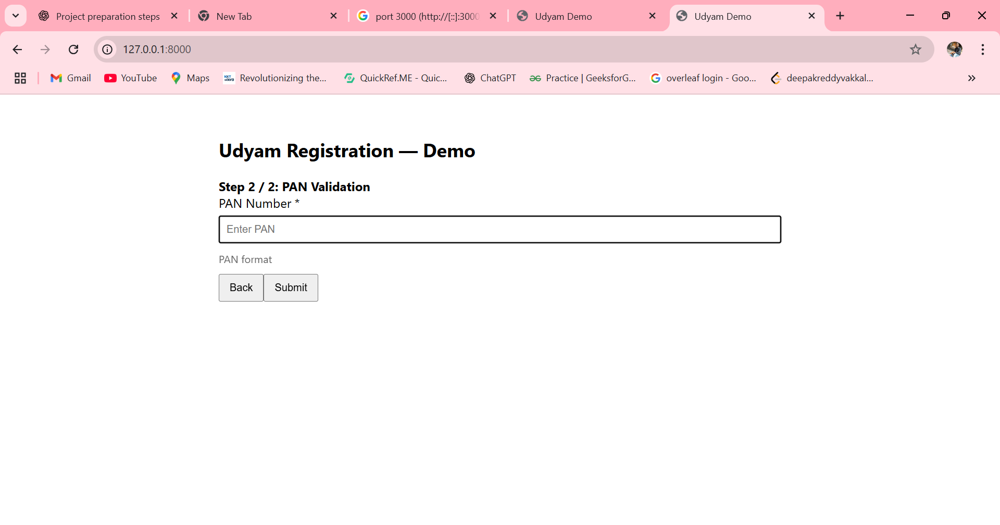
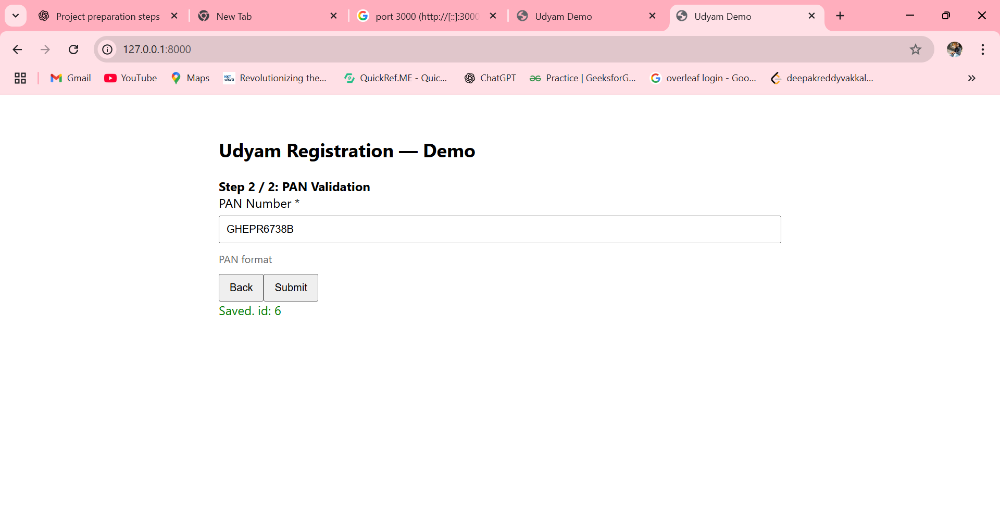

# openbiz-udyam-verification

# OpenBiz Udyam Project — Complete

## 📂 Project Structure
```
openbiz_udyam_project_complete/
│
├── backend/           # Flask backend API
├── frontend_dist/     # Production-ready static frontend
├── frontend_src/      # Source code for frontend (optional for editing)
├── screenshots/       # Demo screenshots
└── README.md
```

---

## 🚀 Quick Start (Windows PowerShell)

### 1️⃣ Backend
```powershell
cd C:\Users\<YourName>\Downloads\openbiz_udyam_project_complete\backend
python -m venv venv
venv\Scripts\Activate.ps1
pip install --upgrade pip
pip install -r requirements.txt
python run.py
```
**Backend will run at:** 🔗 [http://127.0.0.1:8000](http://127.0.0.1:8000)

---

### 2️⃣ Frontend
Open a **new terminal** and run:
```powershell
cd C:\Users\<YourName>\Downloads\openbiz_udyam_project_complete\frontend_dist
python -m http.server 3000
```
**Frontend will run at:** 🔗 [http://127.0.0.1:3000](http://127.0.0.1:3000)

---

## 📝 Notes
- Backend serves static frontend from `../frontend_dist`
- Data is stored in local SQLite file `dev.db` inside backend folder
- To edit frontend, modify files in `frontend_src` and copy updates to `frontend_dist`

---

## 📸 Demo Screenshots

**Step 1 — Homepage**  


**Step 2 — Aadhar Verification**  


**Step 3 — OTP Screen**  


**Step 4 — PAN Card Entry**  


**Step 5 — Final Submission**  


---

## 💡 Author
**Developed by:** V. Deepak Reddy  
📧 **Contact:** your-email@example.com

